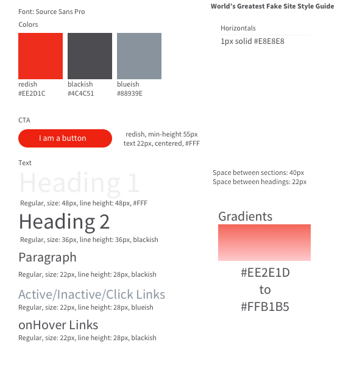

## Save yourself some time

As I'm primarily using Tailwind in my React projects, I couldn't tell you a better recipe for building a UI than using swanky Tailwind CSS styled JSX gumbo.

But let's be honest with ourselves here, we don't *have* to write as much Tailwind as we might be writing. I've been using Tailwind and React for no more than five months, so I'm just learning as I go.

I've found that configuring your project initially will save you a lot of time and stress down the line. Initializing things like Prettier, ESLint, and Postcss before building any part of your UI is the way to go.

## Following a style guide

Recently, I was assigned a coding assessment (how exciting). The coding assessment was to look at a mockup image of a simple landing page and build it. A style-guide was also provided to be followed.

Here's the guide:



This guide was simple enough, and I realized at that moment the importance of implementing this style guide into my code.

## Coding the style guide

Create a *globals.css* file in your directory. I often have mine set up in a 'src' file under styles (*/src/styles/globals.css*). Let's start coding.

First, we see the desired accent and text colors that are to be used. We will set those using [CSS custom variables](https://developer.mozilla.org/en-US/docs/Web/CSS/Using_CSS_custom_properties). I have these defined in the ':root' so that they can be accessed globally as well as in the *globals.css* file itself.

```css
:root {
  --color-fore-reddish: #ee2d1c;
  --color-fore-blackish: #4c4c51;
  --color-fore-blueish: #88939e;
}
```

We can use these root variables in our JSX as well as our coded design system.

Before we create any custom classes for things like buttons and horizontals, let's define the styles for all of the native HTML elements.

```css
@layer base {
  html {
    scroll-behavior: smooth;
  }
  body {
    padding: 0;
    margin: 0;
  }

  /* Base styles following our design system */
  h1 {
    @apply text-[48px] leading-[48px] text-white;
  }
  h2 {
    @apply text-[36px] leading-[36px] text-blackish;
  }
  h3 {
    @apply text-[22px] leading-[28px] text-reddish;
  }
  p {
    @apply text-[22px] leading-[28px] text-blackish;
  }
  a {
    @apply text-[22px] leading-[28px] text-blueish hover:text-blackish cursor-pointer transition;
  }
}
```

We're setting our *@layer* directive to define our *base* styles.With Tailwind CSS, there are three main "buckets" we can add a layer too.

*@layer components* - used for things styling entire components like "Nav" or "cta-btn".

*@layer utilities* - these are universal classes that are present everywhere throughout your code like "flex-col" "opac-half".

*@layer base* - the base layer of our styles, "h1", "h2", "p".

When writing the actual styles in our *globals.css* style sheet, we simply use '@apply' to start writing styles with Tailwind.

```css
/* Input */
  h1 {
    @apply text-[48px] leading-[48px] text-white;
  }
  h2 {
    @apply text-[36px] leading-[36px] text-blackish;
  }

/* Output */
  h1 {
    font-size: 48px;
    line-height: 48px;
    color: rgb(255 255 255); 
  }
  h2 {
    font-size: 36px;
    line-height: 36px;
    color: rgb(76 76 81); 
  }
```

Now let's finish up coding this style guide by defining the component and utility classes.

```css
@layer components {
  .cta-btn {
    @apply bg-reddish text-[22px] text-white py-3 px-8 rounded-full hover:opacity-70 transition whitespace-nowrap;
  }
}

@layer utilities {
  .accent-gradient {
    @apply bg-gradient-to-b from-[#ee2e1d] to-[#ffb1b5];
  }
  .horizontal {
    @apply border-b border-b-[#e8e8e8];
  }
  .horizontal-top {
    @apply border-t border-b-[#e8e8e8];
  }
}
```

## Finding a good balance

Depending on how big your project is and how scalable it needs to be, finding the happy medium for coding your design system is crucial. While you want to set up your project with scalability in mind, you don't want to over engineer and take away from the on-demand benefits of Tailwind.

It is also important to consider how deep your design system (reference) goes and the complexity of your project. Maybe you have a fairly straight forward blog and you only need one or two layouts to achieve the desired design. You wouldn't really have an issue with setting up component and utility classes in your coded design system. 

Then again, you probably wouldn't have a problem writing a few strings in Tailwind for your class names, though our goal is to reduce redundancy at the end of the day, and don't forget how painful it is having to sift through several components and repeatedly change the same styles.

As I'm on this journey to becoming a better programmer, designer, and writer each and every day, I'm constantly finding ways to be more efficient. Let's keep the conversation going over on [LinkedIn](https://www.linkedin.com/in/stefankudla/) and [Twitter](https://twitter.com/stefankudla).

Happy coding and creating!
