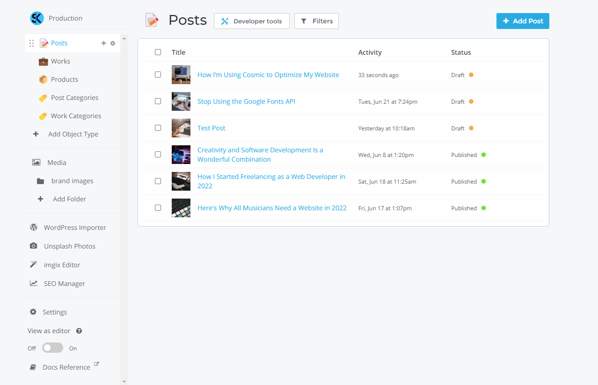
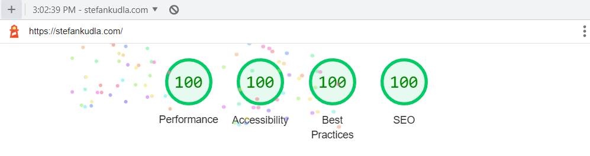

## Introduction

These days, front-end developers have so many amazing tools to build with. We have frameworks and libraries like [Next.js](https://nextjs.org/) and [Svelte](https://svelte.dev/), which we use to get our apps production-ready, and we have content management systems like [Sanity](https://www.sanity.io/) and [Cosmic](https://www.cosmicjs.com/).

In this article, I'm going to tell you why and how I use Cosmic to ensure that my content stays all in one place, and also share some of my favorite features about this powerhouse tool.

## Good tools provide features, great ones give you superpowers

As a developer, I'm constantly looking for ways to write less code, because less code means less potential for bugs. I am in favor of the idea that we can use tools to spend less time in our code editors. Cosmic allows me to do those things. I can import Cosmic into my website and once everything is set up, I can just manage my content via the Cosmic dashboard.

I think anyone can agree with me when I say it feels really nice to use a tool that feels intuitive and fresh. Great tools don't just provide you with features, they give you superpowers. Organization and time management is crucial in the work flow of a developer, and a great content management system helps you stay organized, ultimately allowing you to organize exactly how you would like to.

##  Organization

Let's talk about how important organization is when it comes to a CMS. While I'm the only one accessing the dashboard for [my website](https://stefankudla.com/), you've got to consider the fact that many websites have content teams. Cosmic shines in this aspect because collaboration is at the pinnacle of interest when it comes to its features.

Here is what my dashboard currently looks like:



As you can see, everything has it's own place. I have all of my objects at the top left which includes my posts, works (projects), the products  I display on my about page, and both post and work categories for filtering. Below my objects is where my media lives. I'm able to compartmentalize my images into different folders to stay organized, and whenever I need to use one of them for an article, I can import them with ease.

## Performance

My website is built with Next.js and Cosmic, and these are the lighthouse scores I'm getting for my home page:



Pairing these two technologies truly makes for a tasty combo. Next.js is building all of these articles statically at build time. I wish I had more to say about it, but it just goes to show that for the use cases of blogs and news sites, Cosmic really shines with a framework like Next.js.

## Integration is quick and concise

When using a CMS, developer experience is crucial. I like to be able to get up and running as quickly as possible, and if there's something I don't know how to do, I need to be able to reference the documentation for that tool.

Cosmic has its own NPM module, so getting up and running with it is quite straight forward.

Although I'm using several functions to get data from my Cosmic Bucket, this is how straight forward it is for me to query for data from Cosmic and display my articles on a page.

### Install Cosmic and get environment variables from .env file

```javascript
pnpm i cosmicjs
```

### Import Cosmic

```javascript
const Cosmic = require('cosmicjs')
const api = Cosmic()

const BUCKET_SLUG = process.env.COSMIC_BUCKET_SLUG
const READ_KEY = process.env.COSMIC_READ_KEY

const bucket = api.bucket({
  slug: BUCKET_SLUG,
  read_key: READ_KEY,
})
```

### Creating the async function to get my articles

```javascript
export async function getAllPosts(preview, postType, postCount) {
  const params = {
    query: { type: postType },
    ...(preview && { status: 'any' }),
    props:
      'title,slug,metadata.category,metadata.excerpt,metadata.published_date,created_at,status',
    limit: postCount,
    sort: '-created_at',
  }
  const data = await bucket.getObjects(params)
  return data.objects
}
```

I can even set parameters to dynamically call these functions. In my case, I'm setting a limit for articles on the home page to three to showcase my recent posts, and since I have two different object types in my Bucket ("Posts" and "Works"), they can share the functionality but be called for each case.

```typescript
export async function getStaticProps({ preview = null }) {
  const allPosts = (await getAllPosts(preview, 'posts')) || []
  const allPostCategories = (await getAllCategories('post-categories')) || []
  return {
    props: { allPosts, allPostCategories, preview },
  }
}
```

Bam! We've got all of those articles displayed on my posts page beautifully. Now we can start delegating them into our actual page component props and further them into any other components as props. It's magical.

## Community is everything

It's no doubt that a company with a good connection to their users does better. This is especially true for a company offering a software based product. Upon exploring the [Cosmic website](https://cosmicjs.com/), I quickly found a link to join the [Cosmic Slack channel](https://cosmicslack.herokuapp.com/). I noticed that the community was smaller, though upon entering I could see that if anyone had questions, the companies CEO or someone from the development team would be quick to respond with answers. This is awesome, because as developers, there's nothing like getting help or even delivering feedback directly to those who are working on the product!

Although I did not have any questions or feedback as I first entered, I decided to introduce myself and just let the team at Cosmic know what I was working on. I was delighted to see a prompt response from them, assuring me that there was a good community behind Cosmic. This instantly made me feel better about using the Cosmic CMS knowing that I could get support or feedback whenever, also while knowing there was an active community to interact with!

## Coming from WordPress

One of my biggest hurdles coming from WordPress was that importing all of my content would be an issue. I had around 15 articles that I had written in WordPress, though still wanted on my new site. Fortunately, Cosmic has a WordPress Importer extension. Unfortunately, it was not perfect. I noticed that a lot of my content was imported into the wrong metafields in Cosmic and I had to manually update some things. While this is not the end of the world considering I had a small amount of articles to transfer over, I could see this being a big setback for larger imports.

## Image hosting

While using Cosmic, I've noticed that I find myself hosting images on a Cosmic bucket. If you're already using Cosmic, this is a great solution for storing remote images. Whenever I need to I can just grab my desired images [imgix](https://imgix.com/) URL (since Cosmic optimizes images on the [Imgix CDN](https://imgix.com/solutions/cdn-delivery)). Paired alongside [Next Image](https://nextjs.org/docs/api-reference/next/image), one of my favorite features of Next.js, [fetching remote images](https://stefankudla.com/posts/how-to-use-nextjs-image-with-a-headless-cms) is super easy and performant.


All of my images live in the 'Media' folder, which is there by default. Of course, I could configure sub-folders in there with things like brand images, portraits, images for specific projects I'm working on, you name it. Or, I could even just make separate Buckets for different projects, as this helps me a lot when I'm consulting.

## Oh the possibilities

As for now, I'm using Cosmic to improve my overall experience as a developer. When I'm in my dashboard, I'm in content-creator mode. When I'm in my code editor, I'm in developer mode. I personally don't enjoy managing my content within my codebase, but to each their own. 

I highly recommend hopping aboard the Cosmic spaceship if you:

- Want to write articles
- Want easy image hosting/optimization
- Like working with new tech that is consistently maintained 
- Enjoy using a product that is backed by a supportive community
- Are interested in building with a [headless CMS](https://www.cosmicjs.com/headless-cms)

You can [create an account](https://app.cosmicjs.com/signup) for free and get going with creating your first bucket. You can also join the [Cosmic Slack channel](https://cosmicslack.herokuapp.com/) if you'd like to interact with the growing community.

I'm more than grateful to have stumbled across this wonderful content management system. Through the process of re-building [my website](https://stefankudla.com/) and using Cosmic to do so, I've become a better developer. I've been able to gain clarity on effectively using Next.js for [Static Site Generation](https://www.freecodecamp.org/news/static-site-generation-with-nextjs/), Node.js to [fetch API data](https://docs.cosmicjs.com/examples/basic-queries), and Cosmic to manage the infrastructure of my content.

I've just released an article over on Cosmic about [Creating a Developer Portfolio with Next.js and Cosmic](https://www.cosmicjs.com/articles/creating-a-developer-portfolio-with-nextjs-and-cosmic). If you're looking to build your own developer portfolio and blog then I highly suggest you give it a read!

As always, happy coding and content-creating!
