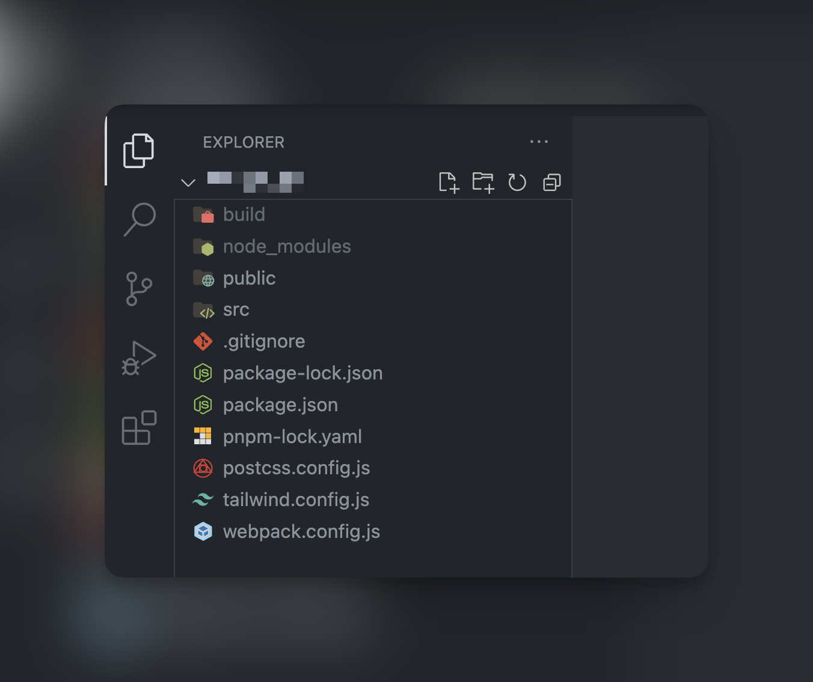
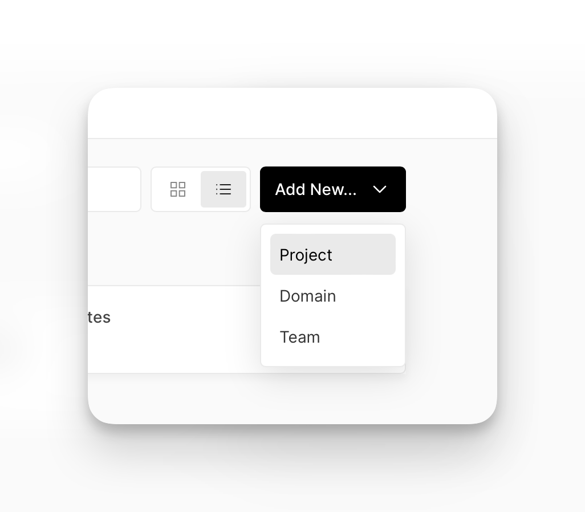
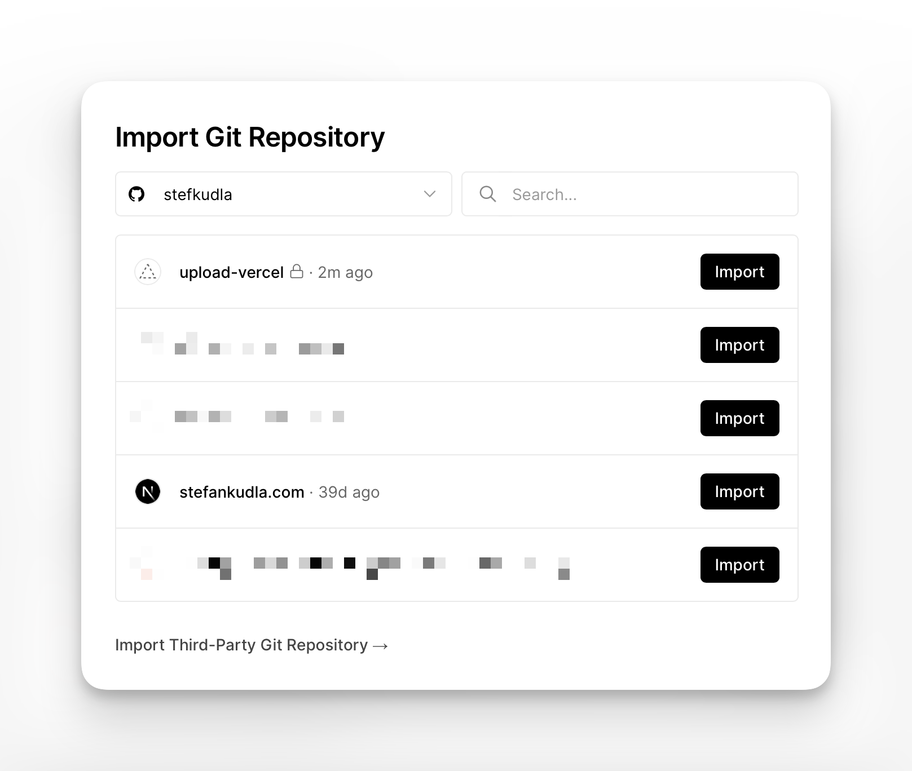
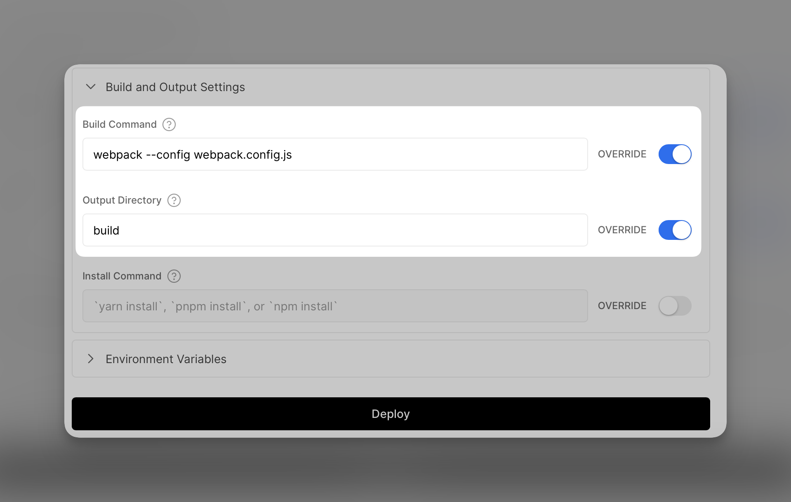
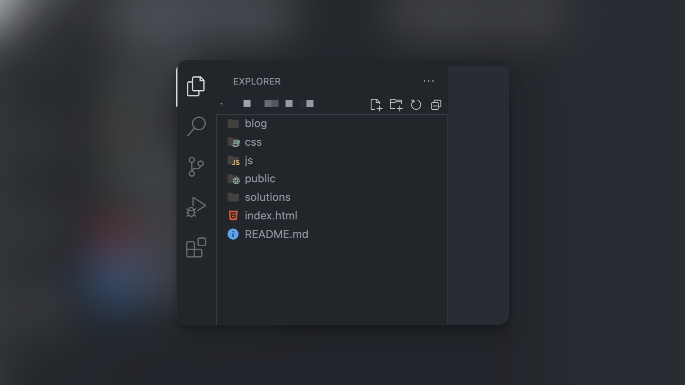
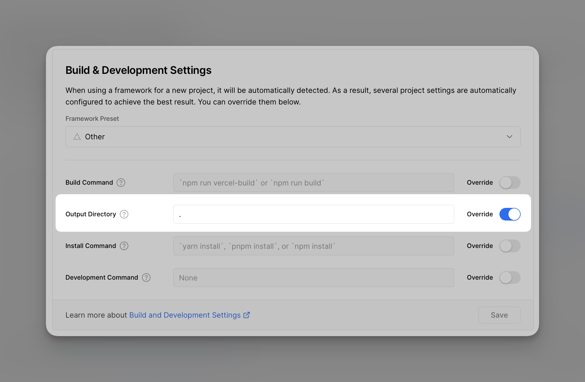

## TLDR

[Build settings using Webpack](#configure-the-vercel-build-and-output-settings)

[Build settings without using Webpack](#deploying-a-website-without-webpack)

Using a platform like [Vercel](http://vercel.com), it’s very easy to deploy a website in seconds. When using Next.js, it’s even easier, as the framework is configured to deploy with just a few clicks.

While it’s not rocket science, it still takes configuring a couple of build settings to successfully deploy a barebones HTML and CSS website to Vercel. In this article, I’m going to show you what settings to use to get your website up and running in no time.

## Project and directory setup

In this example, I’m building a website with:

- HTML
- Tailwind CSS
- JavaScript
- Webpack
- Pnpm

While Webpack is not necessary to deploy a plain HTML and CSS website to Vercel, it definitely helps in development. If you are using Webpack, make sure you are able to successfully run a build using `npm run build` or `pnpm build` or `yarn build` before deploying.

Here’s what my current directory is looking like all set up:



I have my webpack.config.js file outputting my “src” folder to a “build” folder. Here is what that code looks like inside of that config file:

```json
output: {
    filename: 'bundle.js',
    path: path.resolve(__dirname, 'build'),
    clean: true,
    assetModuleFilename: '[path][name][ext]',
  },
```

If you are using Webpack, it’s important to keep in mind where your build output is going for when we configure our project settings on Vercel. While “build” is commonly used, you may be using a different build folder naming, which is fine.

## Create a Public folder

If you haven’t already, make sure you do have a public folder. I know this might seem trivial, but I actually ran into [this error](https://vercel.com/docs/errors#error-list/missing-public-directory) when I first tried deploying my website to Vercel. You do not really need anything inside of it, it just needs to be present.

## Create a new GitHub Repository

One of the best features of Vercel is that you can deploy a website directly from a GitHub Repository. Here’s a [quick guide on how to initialize a git repository](https://kbroman.org/github_tutorial/pages/init.html). Once you have your repository set up on GitHub, we will use Vercel to import it and deploy our website. It does not matter whether your repository is public or private.

## Create a new Vercel project

After creating a Vercel account, which is free for personal use, we can move onto creating the project and importing our GitHub repository. At the top right, just click “Add-new” then “Project”.



Now, you can connect to your GitHub account and import one of your repositories. Go ahead and click “Import” on the repository you would like to deploy.



## Configure the Vercel Build and Output Settings

This is where you can tell Vercel what to do when it tries to build your source code, and where to output that source code. From the code snippet above in the `webpack.config.js` file, wherever you chose to output the source code is the same name you should use in the Vercel settings.



In this scenario, the "Build Command" field should match the "build" script inside your project's `package.json` file, while the "Output Directory" field should match the directory name of the output object in `webpack.config.js`, and in my case, this was "build". Make sure to enable the "OVERRIDE" switch on both of these fields.

## Deploying a website without Webpack

For the absolute minimal project configuration, where you are serving static HTML, CSS, and Javascript files without a `package.json` file, this is possible with Vercel as well.

If your project contains an index.html file in the root, along with folders with your sub pages, CSS, and Javascript:



Follow the steps above, and after you have imported your GitHub repository and get to the configuration settings in Vercel, override the Output Directory field with a period (’.’). This will tell Vercel to simply look at the root of your directory, and while the other fields are left blank, skip the build and package installation and serve your index.html file.



I use Vercel for many personal and freelance projects, and I understand the importance of spinning up a project on there so you can view, test, and share with the world. I hope you found this article helpful and were able to get your website up and running through Vercel.
