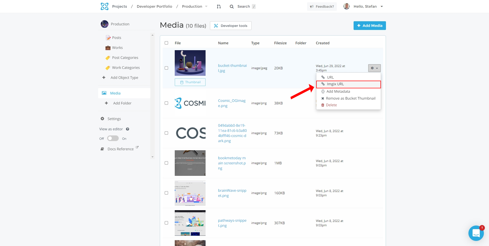

The [Next Image](https://nextjs.org/docs/api-reference/next/image) component is one of the most useful and utilized features of [Next.js](https://nextjs.org/). This component’s performance, ease of use, and flexibility contributes to the amazing developer experience that Next.js offers.

In this article we will explain how using Next.js Image with a [headless CMS](https://www.cosmicjs.com/headless-cms) can automate optimizations for your website images across all devices and network speeds leading to faster website performance and a better experience for your website visitors.

Before we get into the code, let’s make ourselves familiar with the Next Image component and how we use it to load images from a headless CMS. You can also follow along with us [over on YouTube](https://youtu.be/Q-m09YsyBC0), where we discuss this article in depth.

## The Next Image component

The Next Image component provides cutting-edge features design for the modern web by optimizing the standard &lt;img&gt; component in your code. It assigns the HTML &lt;img&gt; [srcset](https://developer.mozilla.org/en-US/docs/Web/API/HTMLImageElement/srcset) so that images are served responsively based on screen size. Smaller devices will be served a smaller image file with a lower resolution, and the image will scale up in resolution as the screen size increases. Next.js handles this *automatically*. Here’s what that looks like:

**Input**

```jsx
<Image
  src={url}
  quality={60}
  alt={`Cover image for ${title}`}
  layout="fill"
  objectFit="cover"
  placeholder="blur"
  blurDataURL={`${url}?auto=format,compress&q=1&blur=500&w=2`}
  priority
/>
```

**Output**

```html

```

Out of the box, the Next Image component also lazily loads the images so that they become non-blocking elements. This gives our applications improved page loads and overall better Core Web Vitals. Already, we can see that Next Image handles a lot of the heavy lifting for the developer, and as you explore the component further, you will find even more useful features and use cases.

## Images in a headless CMS

When using a CMS like Cosmic, we get some great features that help us store our images in one place, and at that, we can serve these images via the [Cosmic API](https://docs.cosmicjs.com/api-reference/introduction) and [global CDN](https://www.cosmicjs.com/knowledge-base/image-api-and-cdn). This means our images won’t live on just one server, but rather on a group of geographically distributed and interconnected servers. These servers will cache the images from a network location closest to the user to speed up page loads.

Why does any of this matter? User experience. As the modern web develops further and further, we find better solutions that decrease media file size, utilize non-blocking techniques, and get the content of your site to the user much quicker than ever before. This leads to higher consumer retention rates, better conversion rates, and a globally uniform experience for users.

## Getting the data from our Cosmic Bucket

If you’d like to follow along with this particular use case, you can install the [Developer Portfolio app template](https://www.cosmicjs.com/apps/developer-portfolio) and clone the [GitHub repository](https://github.com/cosmicjs/nextjs-developer-portfolio).

First, we must get the data from our Cosmic Bucket into our project using the [Cosmic NPM package](https://www.npmjs.com/package/cosmicjs).

```jsx
const Cosmic = require('cosmicjs')
const api = Cosmic()
const bucket = api.bucket({
  slug: process.env.COSMIC_BUCKET_SLUG,
  read_key: process.env.COSMIC_READ_KEY,
})
export async function getAllPosts() {
  const params = {
    query: { type: 'posts' }
    props: 'title,slug,metadata',
    sort: '-created_at',
  }
  const data = await bucket.getObjects(params)
  return data.objects
}
```

We create an asynchronous function to call the Cosmic API and get all of the ‘posts’ from our Cosmic Bucket by setting the query params to ‘type: “posts”’ (the name of our posts object in Cosmic). 

## Loading images remotely

Within the Cosmic dashboard, we can access the images we’ve uploaded to the Cosmic CDN simply by navigating to the media folder. From there, we have a few options such as grabbing the URL, the [imgix](https://imgix.com/) URL, and adding metadata to the image, such as alt text.

For static images, we can always set the ‘src’ in our Image component to a specific URL. In your Cosmic dashboard, navigate to the ‘media’ folder, and on one of the images you’ve uploaded, click on the gear icon. Click on either the ‘URL’ or the ‘imgix URL’ selection, and copy and paste the link of the image.



In the code, it would look something like this:

```jsx
<Image
  src={'https://imgix.cosmicjs.com/87625240-0acb-11ed-b7be-d956591ad437-design-systems-tailwind.png'}
  alt={'Cover image for my article'}
  layout="responsive"
  width={1200}
  height={640}
  priority
/>
```

Realistically, we may use a few static remote URLs for the Next Image component in a project, though most commonly we will use Static Imports (images stored locally within the directory of the project) or dynamic URLs from the headless CMS.

In our use case, we will be loading the images from blog posts. Cosmic makes it easy to do this as when you create a new object in Cosmic, you can configure the object [Metafields](https://docs.cosmicjs.com/api-reference/metafields) to contain an image Metafield. As a result, creating a new article will give the user the ability to upload the image to the Cosmic CDN and attach it to the blog post all in one go.

## Coding the solution

On our ‘[slug]’ pages, we can get the posts by their slug and query for the metadata. We’re using [getStaticProps](https://nextjs.org/docs/basic-features/data-fetching/get-static-props) and [getStaticPaths](https://nextjs.org/docs/basic-features/data-fetching/get-static-paths) to get our dynamic posts.

```jsx
// /src/posts/[slug].jsx
export async function getStaticProps({ params }) {
  const data = await getPostAndMorePosts(params.slug, preview)
  return {
    props: {
      post: {
        ...data.post,
        content,
      },
    },
  }
}

export async function getStaticPaths() {
  const allPosts = (await getAllPostsWithSlug()) || []
  return {
    paths: allPosts.map(post => `/posts/${post.slug}`),
    fallback: true,
  }
}
```

Now let’s pass the data into our Next Image component for our blog post header.

```jsx
// /src/posts/[slug].jsx
import Image from 'next/image'

const Post = ({ post, preview }) => {
  const router = useRouter()
  if (!router.isFallback && !post?.slug) {
    return <PageNotFound />
  }
  return (
    <div className="relative w-full my-4 pb-[55%]">
       <Image
          src={post.metadata.cover_image.imgix_url}
          quality={60}
          alt={`Cover image for ${title}`}
          layout="fill"
          objectFit="cover"
          priority
       />
    </div>
  )
}
export default Post
```

## Placeholders

To add a placeholder for our remote images, we can utilize imgix queries to request a low-resource version of the image. This image is very small, compressed, and blurred to ensure a very small file size. First we set the *placeholder* param to ‘blur’ and pass the special URL to the *blurDataURL* param.

```jsx
<Image
  src={post.metadata.cover_image.imgix_url}
  quality={60}
  alt={`Cover image for ${title}`}
  layout="fill"
  objectFit="cover"
  placeholder="blur"
  blurDataURL={`${post.metadata.cover_image.imgix_url}?auto=format,compress&q=1&blur=500&w=2`}
  priority
/>
```

**The result**


## Performance optimizations

With Cosmic, we can optimize our images within the dashboard by adding things like specified quality, dimensions, and compression before the images get requested. To do this, go to the Cover Image Metafield and click the Settings button. Then in the settings modal we can add some compression which will reduce the file size and improve the page load. Just like with the placeholder we used earlier, this will add imgix query params to the imgix URL.


## The perfect solution

While there isn’t a perfect solution, the Next Image component does a lot of the work for us by providing features to enable us to fine-tune our images to achieve optimal image sizes and performance across all devices and network speeds ultimately leading to a better experience for our website visitors.
